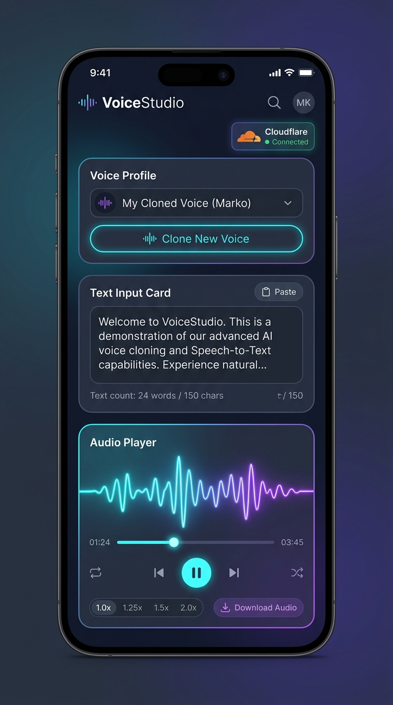

# VoiceStudio Mobile — Flutter Aplikacija (Plan Izvedbe)

Ovaj direktorij namijenjen je za budući razvoj nativne mobilne aplikacije (Flutter/Android) koja se povezuje na VoiceStudio kućni poslužitelj putem Cloudflare Tunnela.

---

## 📱 Vizualni dizajn i izgled sučelja



---

## 1. Arhitektura povezivanja

Aplikacija komunicira s VoiceStudio FastAPI backendom preko Cloudflare Zero Trust tunela:

```text
[ Mobitel (Flutter App) ]
         │  (HTTPS pozivi s Cloudflare Service Tokenom)
         ▼
[ Cloudflare Edge Mreža ]
         │  (Sigurni tunel - cloudflared)
         ▼
[ Kućno računalo (FastAPI Backend na :3900 / Web :3901) ]
```

### Autentifikacija
- **Cloudflare Service Token:** U Cloudflare Zero Trust konzoli kreira se namjenski Service Token za mobilnu aplikaciju (`CF-Access-Client-Id` i `CF-Access-Client-Secret`).
- Flutter mrežni klijent (Dio) automatski dodaje ta dva zaglavlja u svaki HTTP zahtjev, čime se izbjegava stalno traženje PIN koda.

---

## 2. Ključni Flutter paketi (`pubspec.yaml`)

| Paket | Namjena |
| :--- | :--- |
| **`dio`** | HTTP klijent s podrškom za interceptore, upload datoteka i streaming odgovora. |
| **`record`** | Snimanje uzoraka glasa putem mikrofona mobitela (.wav / .m4a) za kloniranje glasa. |
| **`just_audio`** | Robustan audio player za reprodukciju generiranog zvuka uz kontrolu brzine (1.0x – 2.0x). |
| **`audio_video_progress_bar`** | Interaktivna traka za prikaz napretka i premotavanje zvuka. |
| **`flutter_secure_storage`** | Sigurno lokalno spremanje adrese poslužitelja i Cloudflare tokena na uređaju. |
| **`flutter_riverpod`** | Upravljanje stanjem aplikacije (state management). |
| **`receive_sharing_intent`** | *(Opcionalno)* Primanje označenog teksta iz drugih Android aplikacija (Speechify način rada). |

---

## 3. Struktura ekrana i korisničko iskustvo (UI/UX)

1. **Postavke veze (Settings / Setup Screen)**
   - Unos adrese poslužitelja (npr. `https://studio.mojadomena.com`).
   - Unos `Client ID` i `Client Secret` tokena.
   - Gumb *"Testiraj vezu"* (provjera rute `GET /system/info`).

2. **Upravljanje profilima glasa (Voice Profiles / Clone Screen)**
   - Prikaz postojećih kloniranih glasova (`GET /profiles`).
   - Gumb *"Snimi novi glas"* s vizualizacijom razine mikrofona (10–30 s čitanja teksta).
   - Mogućnost odabira postojeće audio datoteke s uređaja.
   - Slanje uzorka na backend (`POST /profiles`).

3. **Glavni ekran: TTS Generator & Player (Speechify mod)**
   - Padajući izbornik za odabir željenog glasa.
   - Polje za unos/lijepljenje teksta s brojačem riječi i znakova.
   - Gumb *"Generiraj govor"*.
   - **Audio Player:**
     - Neonska vizualizacija valnog oblika (waveform).
     - Tipke: Play, Pause, premotavanje naprijed/natrag za 10 sekundi.
     - Odabir brzine govora: `1.0x`, `1.25x`, `1.5x`, `2.0x`.
     - Gumb za spremanje/preuzimanje `.wav` datoteke u memoriju mobitela.

---

## 4. Ključne API rute VoiceStudio backenda

| Funkcija | Metoda i ruta | Format podataka |
| :--- | :--- | :--- |
| **Provjera stanja poslužitelja** | `GET /system/info` | JSON (status, GPU/CPU info) |
| **Popis glasovnih profila** | `GET /profiles` | JSON (lista profila s ID-evima i nazivima) |
| **Kreiranje profila (kloniranje)** | `POST /profiles` | `multipart/form-data` (audio datoteka + ime) |
| **Generiranje govora (TTS)** | `POST /generation/generate` (ili `/tts`) | JSON (`text`, `voice_id`, `engine`, `speed`) |
| **Preuzimanje audio datoteke** | `GET /outputs/{filename}` | Audio stream (`audio/wav` ili `audio/mpeg`) |

---

## 5. Faze razvoja i status

- [x] **Faza 1:** Inicijalizacija Flutter projekta, struktura mapa i mrežni sloj (`ApiClient` s Cloudflare zaglavljima i 302 detekcijom).
- [x] **Faza 2:** Snimanje zvuka mikrofonom (`record`), verifikacija uzorka i slanje na backend za kloniranje glasa (`POST /profiles`) uz mogućnost brisanja profila (`DELETE /profiles/{id}`).
- [x] **Faza 3:** Glavni ekran za unos teksta, odabir jezika i glasa, poziv TTS rute i reprodukcija zvuka (`just_audio`, waveform traka, brzine).
- [x] **Faza 4 (Dodatne opcije):**
  - **Voice Styling & Advanced Controls:** Emocije (Whisper, Excited, Authoritative, Storyteller, Calm, Sad...), prilagođeni stilski prompt (instruct), klizač koraka kvalitete (8–32) i CFG guidance scale (1.0–4.0).
  - **Offline knjižnica (Library):** Trajno lokalno spremanje generiranih zapisa na memoriju mobitela, pretraga, favoriti i dijeljenje.
  - **Speechify mod:** Pametno segmentiranje dugog teksta po odlomcima/rečenicama s navigacijom.
- [ ] **Faza 5:** Android Share Intent (primanje označenog teksta izravno iz drugih Android aplikacija) i pozadinska reprodukcija (traka obavijesti).
